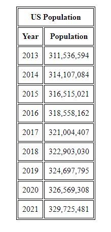
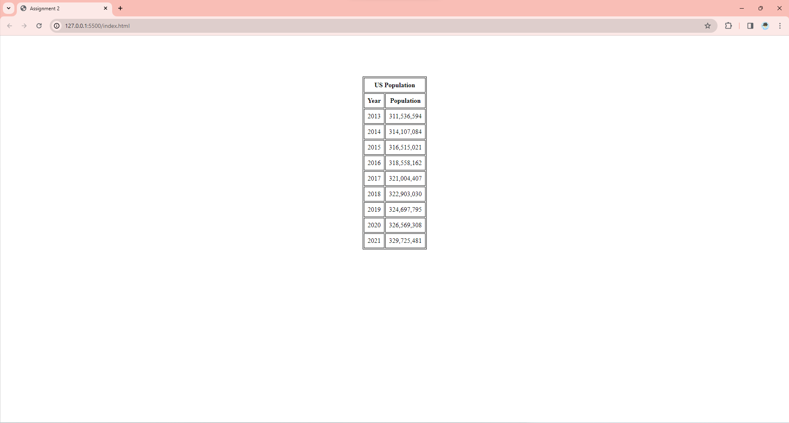

# Assignment 2: API, JSON, HTML, JavaScript
Carlo Velarde

## TOC 
* index.html, script.js, styles.css and assets are in the base of the parent directory
* example images of the output are found in the assets folder

## About
* This repository is the solution to Assignment 2 for CS:3980
* It displays the US population data over a couple year span
* The index.html file fetches the USA population over the last few years from an API endpoint provided by Data USA. 
* The population data is displayed in a basic HTML table.
* index.html is used for displaying the data (the table)
* styles.css styles the html page 
* script.js fetches the data, parses, and adds it to the existing html table found in index.html

## Visual of the project

